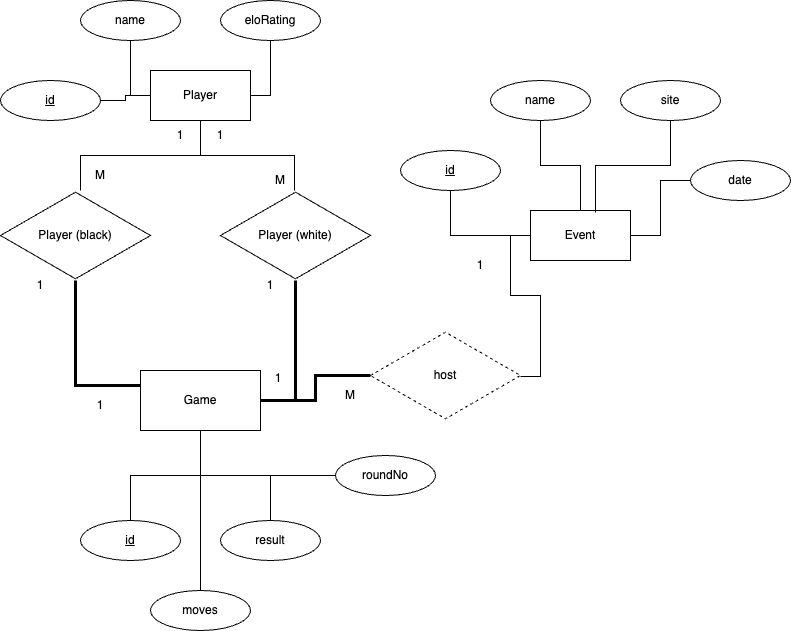

# Lab 2: ER Model

## Part 1 - ER Diagram for Chess Database



\pagebreak 
## Part 2 - SQL Tables

### Schemas

```txt
Player [__id__ (integer), name (string), eloRating (integer)]

Event [__id__ (integer), name (string), site (string), date (date)]

Game [__id__ (integer), result (string), moves (string), 
      blackPlayerId (integer), whitePlayerId (integer), 
      eventId (integer), roundNo (integer)]
```

\pagebreak 
### SQL commands to create the tables representing the chess database

```mysql
CREATE DATABASE Chess;
USE Chess;

CREATE TABLE Player (
  id INT PRIMARY KEY AUTO_INCREMENT,
  name VARCHAR(255),
  eloRating INT
);

CREATE TABLE Event (
  id INT PRIMARY KEY AUTO_INCREMENT,
  name VARCHAR(255),
  site VARCHAR(255),
  date DATE,
  CONSTRAINT uc_name_date UNIQUE (name, date)
);

CREATE TABLE Game (
  id INT PRIMARY KEY AUTO_INCREMENT,
  result VARCHAR(255),
  blackPlayerId INT,
  whitePlayerId INT,
  moves TEXT,
  eventId INT,
  roundNo INT,
  FOREIGN KEY (blackPlayerId) REFERENCES Player(id) ON DELETE CASCADE ON UPDATE CASCADE,
  FOREIGN KEY (whitePlayerId) REFERENCES Player(id) ON DELETE CASCADE ON UPDATE CASCADE,
  FOREIGN KEY (eventId) REFERENCES Event(id) ON DELETE CASCADE ON UPDATE CASCADE,
  CONSTRAINT unique_event_round UNIQUE (eventId, roundNo)
);

DELIMITER //

CREATE TRIGGER check_different_players
BEFORE INSERT ON Game
FOR EACH ROW
BEGIN
    IF NEW.blackPlayerId = NEW.whitePlayerId THEN
        SIGNAL SQLSTATE '45000' 
        SET MESSAGE_TEXT = 'Black player and white player must be different.';
    END IF;
END; //

DELIMITER ;
```